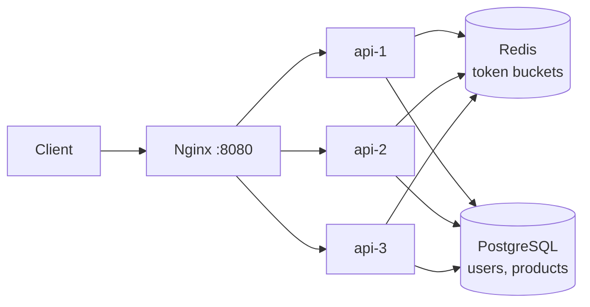
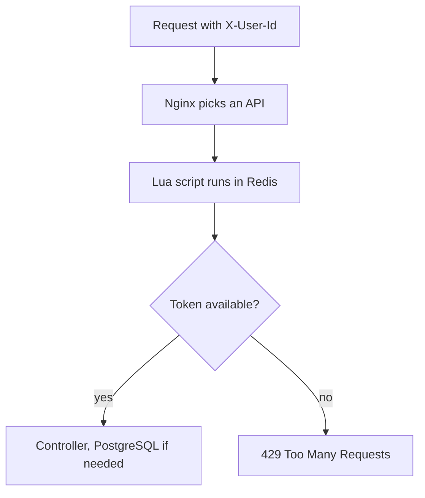

# Distributed Rate Limiter

A learning project: a per-user token-bucket rate limiter that works across multiple API instances. Three Express servers sit behind Nginx and share one Redis, so a user's limit is the same no matter which server handles the request.

It is an experiment, not production code. There is no authentication.

## Why I built it

To understand how rate limiting works with more than one server. A counter in each server's memory breaks as soon as a load balancer spreads one user's requests around, so the state has to live in a shared place. Here that is Redis.

## Architecture



Node.js, TypeScript, Express 5, Redis, PostgreSQL with Prisma 7, Nginx and Docker Compose. PostgreSQL is not in the compose file. The containers connect to a Postgres running on your machine.

## Request flow



Responses from limited routes include an `X-RateLimit-Remaining` header, and the JSON body includes `server` so you can see which instance answered.

## Token bucket

Each bucket has a capacity and a refill rate. A request costs one token. Tokens refill over time (calculated on each request, no background job) and never go above capacity. A new bucket starts full.

Every route has its own scope, so one user has a separate bucket per scope. The Redis key is `rate-limit:<scope>:user:<X-User-Id>`.

| Route                      | Scope             | Capacity | Refill      |
| -------------------------- | ----------------- | -------- | ----------- |
| `GET /api/test/normal`     | `normal`          | 10       | 1 token/sec |
| `POST /api/test/sensitive` | `sensitive`       | 5        | 1 token/min |
| `GET /api/users/:id`       | `users`           | 10       | 1 token/min |
| `GET /api/products`        | `products-list`   | 10       | 1 token/sec |
| `POST /api/products`       | `products-create` | 5        | 1 token/min |

`POST /api/users` is not limited.

## Why Redis Lua

Checking a bucket is read, calculate, write. If the app does that with separate Redis commands, two servers can read the same token count at once and both allow a request. A Lua script runs as one step inside Redis, so nothing can slip in between. The script ([src/lib/token-bucket.lua](src/lib/token-bucket.lua)) also uses the Redis clock, so the servers never disagree about time.

## How it works across servers

The API instances keep no rate-limit state. Every instance asks the same Redis, so 30 parallel requests from one user spread over three servers still get 10 in total, not 10 per server. Different users and different scopes use different keys, so their buckets don't affect each other.

## Project structure

```
src/
  server.ts, app.ts       start Express, mount routes
  config/redis.ts         Redis client
  lib/prisma.ts           Prisma client
  lib/token-bucket.lua    the token bucket
  middleware/             rate limit middleware
  routes/ controllers/ services/
prisma/                   schema and migrations
nginx/nginx.conf          load balancer config
docker-compose.yml        redis, api-1..3, nginx
```

## Run it

You need Docker and a PostgreSQL server on `localhost:5433`.

```bash
git clone https://github.com/cwayush/SD-Rate-Limiter.git
cd SD-Rate-Limiter
cp .env.example .env
cp .env.docker.example .env.docker
```

In both files, replace `username:postgres` in `DATABASE_URL` with your Postgres `user:password`. Create the database named in the URL (`rate_limiter_db`):

```bash
psql -h localhost -p 5433 -U <user> -c "CREATE DATABASE rate_limiter_db"
```

Start it:

```bash
docker compose up --build
```

The build generates the Prisma client and each container applies the migrations on start. Check it, and run it a few times to see `server` change:

```bash
curl localhost:8080/health
```

`.env` is for commands on your machine, `.env.docker` is for the containers. They differ only in hosts: Postgres is `localhost` vs `host.docker.internal`, Redis is `localhost` vs `redis`.

The containers don't mount the source code, so after editing code run `docker compose up -d --build`.

## Try the APIs

Commands are for Bash (Git Bash on Windows works). Create a user and keep its id:

```bash
ID=$(curl -s -X POST localhost:8080/api/users \
  -H "Content-Type: application/json" \
  -d "{\"email\":\"ada-$RANDOM@example.com\",\"name\":\"Ada\"}" \
  | grep -o '"id":"[^"]*"' | head -1 | cut -d'"' -f4)
echo $ID
```

Use that id as `X-User-Id`:

```bash
curl localhost:8080/api/users/$ID -H "X-User-Id: $ID"

curl -X POST localhost:8080/api/products \
  -H "Content-Type: application/json" -H "X-User-Id: $ID" \
  -d '{"name":"Keyboard","price":49.99}'

curl localhost:8080/api/products -H "X-User-Id: $ID"
```

`X-User-Id` is only the rate-limit identity, there is no login. Use the id of a real user for `POST /api/products`, because the product is stored against that user.

See the buckets in Redis:

```bash
docker exec rate-limiter-redis redis-cli --scan --pattern "rate-limit:*:user:$ID"
```

## Load test

30 parallel requests from one user to a route that allows 10:

```bash
seq 1 30 | xargs -P 30 -I{} curl -s -o /dev/null -w "%{http_code}\n" \
  -H "X-User-Id: load-user" http://localhost:8080/api/test/normal | sort | uniq -c
```

```
 10 200
 20 429
```

To see which instance answered each request:

```bash
seq 1 30 | xargs -P 30 -I{} curl -s -w "\n" \
  -H "X-User-Id: load-user-2" http://localhost:8080/api/test/normal | grep -o 'API-[0-9]' | sort | uniq -c
```

```
 10 API-1
 10 API-2
 10 API-3
```

Nginx split the requests evenly and still only 10 were allowed. Use a new user id for each run, or wait for the bucket to refill.

Scopes are independent. Empty the `sensitive` bucket, then call another route as the same user:

```bash
for i in 1 2 3 4 5 6; do
  curl -s -o /dev/null -w "%{http_code} " -X POST localhost:8080/api/test/sensitive -H "X-User-Id: $ID"
done; echo
curl -s -o /dev/null -w "%{http_code}\n" localhost:8080/api/test/normal -H "X-User-Id: $ID"
```

```
200 200 200 200 200 429
200
```

A rejected request looks like this:

```
HTTP/1.1 429 Too Many Requests
{"message":"Too many requests","server":"API-2"}
```

## Known limitations

- `X-User-Id` is trusted as sent, anyone can use any id.
- `POST /api/users` is not rate limited.
- `POST /api/products` doesn't validate `name` and `price`, and an unknown user id returns a 500.

## What I learned

- Per-server counters don't work behind a load balancer, the state has to be shared.
- Read-then-write on Redis must be atomic, and a Lua script is the simple way to do it.
- A token bucket is just two numbers: tokens and last refill time.
- What a bucket is shared across (user, route) matters as much as the algorithm. My first version used one bucket for all routes and their limits fought each other.
- Nginx has its own connection limit. A 300-request burst dropped connections until I raised `worker_connections`.
